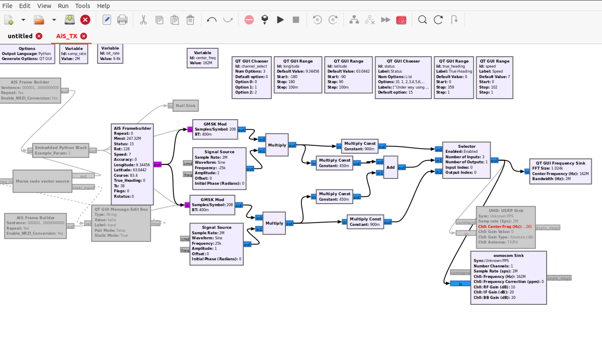

# grc-ais-vdes-framebuilder
Python block AIS Framebuilder written for GNU Radio Companion >=3.8. (ITU-R_M.1371-5 compliant).

Python block VDE-TER Framebuilder written for GNU Radio Companion >=3.8. (ITU-R_M.2092-1 compliant).



# Acknowledgments
This project was inspired by the works carried out by [Trendmicro](https://github.com/trendmicro/ais), who made the original AIS Frame Builder block in C++. Building on this, we have written an equivalent block in Python 3, which is now supported as an embedded block in GRC >=3.8. This block enables customization, and allows AIS ship values to be assigned at runtime using GRC widgets.

# Dependencies
Please also download and install the grc block for your SDR (```gr-osmosdr```, ```gr-uhd``` ...) if you intend to use one.

# Contents

```AIS_Framebuilder.py```
- The python GRC frame builder block.

```AiS_TX.grc```
- GRC Flowgraph which can be imported into GNU Radio Companion.

```top_block.py```
- The full python program for the flow graph, runnable in the terminal.

# Disclaimer
Both the AIS and VDES Frame builders are compliant with the mentioned ITU-R reccomendations regarding the construction of data frames, and are tools intended for educational and research purposes only. However, they do not cover other aspects such as Medium Access Control (MAC), which are needed to be fully compliant system. This software is provided "as-is" and does not replace commercially available products, and should not be used as such. Misuse of this software can be harmful, and the authors will not take any responsibility for illegal actions carried out using the tools found in this repository.
